# Sevak Mini Tractor: System Architecture

## Table of Contents
1. [Architecture Overview](#1-architecture-overview)
2. [Hardware Architecture](#2-hardware-architecture)
3. [Software Architecture](#3-software-architecture)
4. [Mobile App Architecture](#4-mobile-app-architecture)
5. [Communication Protocols](#5-communication-protocols)
6. [Data Flow Diagrams](#6-data-flow-diagrams)
7. [Security Architecture](#7-security-architecture)

## 1. Architecture Overview

### 1.1 System Context

The Sevak mini tractor is an autonomous electric agricultural vehicle designed for small-scale farmers in rural India. The system consists of four primary components:

1. **Tractor Hardware Platform**: The physical tractor with electric motors, sensors, actuators, and control systems
2. **Onboard Software System**: Software running on the tractor for autonomous operation, sensor fusion, and control
3. **Mobile Application**: User interface for monitoring and controlling the tractor
4. **Optional Cloud Services**: For remote monitoring, updates, and multi-tractor coordination

### 1.2 Key Architectural Principles

1. **Modularity**: Components are designed with clear interfaces to enable independent development and maintenance
2. **Redundancy**: Critical systems have redundant components to ensure safety and reliability
3. **Graceful Degradation**: System maintains core functionality even when some components fail
4. **Offline Operation**: Primary functions work without internet connectivity
5. **Resource Efficiency**: Optimized for limited computational resources and power constraints
6. **Extensibility**: Architecture supports future additions of new implements and capabilities
7. **Security by Design**: Security controls integrated at all levels of the system
### 1.3 High-Level Architecture Diagram

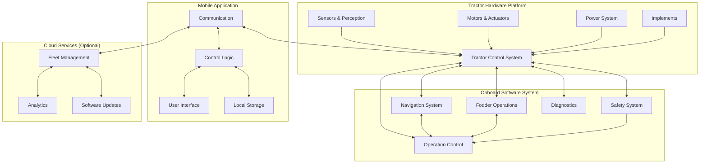

## 2. Hardware Architecture

### 2.1 Physical Components Overview

```mermaid
graph TD
    subgraph "Chassis & Frame"
        Frame[Steel Alloy Frame]
        Suspension[Independent Suspension]
        Wheels[4 Wheels with Agricultural Tread]
    end
    
    subgraph "Power System"
        Battery[LiFePO4 Battery Packs]
        BMS[Battery Management System]
        PowerDist[Power Distribution]
        Charging[Charging System]
        SolarOpt[Optional Solar Input]
    end
    
    subgraph "Drive System"
        Motors[4 × BLDC Hub Motors]
        ESCs[Electronic Speed Controllers]
        Brakes[Regenerative & Hydraulic Brakes]
    end
    
    subgraph "Implements"
        CuttingMech[Cutting Mechanism]
        LoadingMech[Loading Mechanism]
        Container[Storage Container]
        Attachments[Interchangeable Attachments]
    end
    
    subgraph "Control Hardware"
        MainController[Main Controller]
        SafetyController[Safety Controller]
        IO[I/O Interfaces]
        HMI[Local HMI]
    end
    
    Frame --> Suspension
    Suspension --> Wheels
    
    Battery --> BMS
    BMS --> PowerDist
    Charging --> Battery
    SolarOpt --> Battery
    
    PowerDist --> Motors
    PowerDist --> MainController
    PowerDist --> Implements
    
    Motors --> ESCs
    ESCs --> Brakes
    
    MainController --> ESCs
### 2.2 Sensor Architecture

```mermaid
graph TD
    subgraph "Navigation Sensors"
        GPS[GNSS with RTK]
        IMU[9-axis IMU]
        WheelEnc[Wheel Encoders]
        UWB[UWB Positioning]
    end
    
    subgraph "Environmental Sensors"
        Cameras[360° Cameras]
        LIDAR[3D LIDAR]
        Ultrasonic[Ultrasonic Sensors]
        Weather[Weather Sensors]
    end
    
    subgraph "Operational Sensors"
        LoadCells[Load Cells]
        PowerMon[Power Monitoring]
        ThermalSensors[Thermal Sensors]
        VibrationSensors[Vibration Sensors]
    end
    
    subgraph "Implement Sensors"
        CutHeight[Cutting Height Sensors]
        LoadSensors[Loading System Sensors]
        FillLevel[Container Fill Level]
        ObstructionSensors[Obstruction Sensors]
    end
    
    subgraph "Sensor Fusion"
        LocalizationFusion[Localization Fusion]
        ObstacleFusion[Obstacle Detection Fusion]
        OperationalFusion[Operational Data Fusion]
    end
    
    GPS --> LocalizationFusion
    IMU --> LocalizationFusion
    WheelEnc --> LocalizationFusion
    UWB --> LocalizationFusion
    
    Cameras --> ObstacleFusion
    LIDAR --> ObstacleFusion
    Ultrasonic --> ObstacleFusion
    
    LoadCells --> OperationalFusion
    PowerMon --> OperationalFusion
    ThermalSensors --> OperationalFusion
    VibrationSensors --> OperationalFusion
    
    CutHeight --> OperationalFusion
    LoadSensors --> OperationalFusion
    FillLevel --> OperationalFusion
    ObstructionSensors --> OperationalFusion
    
    Weather --> LocalizationFusion
    Weather --> OperationalFusion
```

### 2.3 Control Systems Architecture

```mermaid
graph TD
    subgraph "Main Control System"
        MainCPU[Quad-core CPU]
        RTOS[Real-time OS]
        MainMemory[Main Memory]
        Storage[Local Storage]
    end
    
    subgraph "Safety Control System"
        SafetyCPU[Redundant Safety CPU]
        WatchdogTimer[Watchdog Timer]
        EmergencyCircuits[Emergency Circuits]
    end
    
    subgraph "Motor Control"
        MotorControllers[Motor Controllers]
        EncoderInterfaces[Encoder Interfaces]
        CurrentSensing[Current Sensing]
    end
    
    subgraph "Implement Control"
        CuttingControl[Cutting Control]
        LoadingControl[Loading Control]
        ContainerControl[Container Control]
    end
    
    subgraph "Communication Hardware"
        WiFiModule[Wi-Fi Module]
        BluetoothModule[Bluetooth Module]
        CellularModule[Cellular Module]
        LoRaModule[LoRa Module]
    end
    
    MainCPU --> RTOS
    MainCPU --> MainMemory
    MainCPU --> Storage
    
    MainCPU --> MotorControllers
    MainCPU --> CuttingControl
    MainCPU --> LoadingControl
    MainCPU --> ContainerControl
    
    MainCPU --> WiFiModule
### 2.4 Hardware Components Specifications

#### 2.4.1 Compute and Control Hardware

| Component | Specification | Redundancy |
|-----------|--------------|------------|
| Main Controller | Quad-core ARM Cortex-A72, 2GHz, 4GB RAM | Dual redundant for critical functions |
| Safety Controller | Dual-core ARM Cortex-R5, 600MHz, 512MB RAM | Triple redundant voting system |
| Local Storage | 128GB industrial-grade eMMC | Redundant storage with journaling |
| I/O Interfaces | CAN bus, RS-485, GPIO, I2C, SPI | Multiple bus systems |

#### 2.4.2 Sensor Hardware

| Sensor Type | Specification | Quantity | Purpose |
|-------------|--------------|----------|---------|
| GNSS Receiver | Multi-constellation with RTK, 2cm accuracy | 1 | Precise positioning |
| IMU | 9-axis, 200Hz update rate | 2 | Orientation and motion tracking |
| Wheel Encoders | 1024 PPR optical encoders | 4 | Odometry |
| Cameras | 1080p, 120° FOV, low-light capable | 4 | 360° visual perception |
| LIDAR | 16-channel, 30m range, 10Hz scan rate | 1 | 3D obstacle detection |
| Ultrasonic Sensors | 5m range, 40Hz update rate | 8 | Close-range obstacle detection |
| Load Cells | 500kg capacity, 0.1% accuracy | 4 | Weight measurement |
| Thermal Sensors | -20°C to 120°C range | 12 | Component temperature monitoring |

#### 2.4.3 Power System Hardware

| Component | Specification | Redundancy |
|-----------|--------------|------------|
| Battery Packs | LiFePO4, 48V nominal, 10-15kWh total | Modular design with 4 independent packs |
| BMS | Cell-level monitoring, thermal management | Independent BMS per battery pack |
| Motor Controllers | 4 × 2kW continuous (8kW peak) | Independent controller per motor |
| Charging System | 3.3kW standard, 6.6kW fast charge option | Surge protection, multiple input options |
| Power Distribution | Centralized with circuit protection | Redundant power paths for critical systems |

#### 2.4.4 Communication Hardware

| Component | Specification | Range | Purpose |
|-----------|--------------|-------|---------|
| Wi-Fi | 802.11ac, 2.4/5GHz | 100m | Local control and data transfer |
| Bluetooth | BLE 5.0 | 50m | Configuration and diagnostics |
| Cellular | 4G LTE with 2G fallback | Network dependent | Remote monitoring and control |
| LoRaWAN | 868/915MHz | 2-5km | Low-bandwidth backup communication |
| Mesh Network | 2.4GHz, 250kbps | 300m between nodes | Inter-tractor communication |
    MainCPU --> BluetoothModule
    MainCPU --> CellularModule
    MainCPU --> LoRaModule
    
    SafetyCPU --> WatchdogTimer
    SafetyCPU --> EmergencyCircuits
    SafetyCPU --> MotorControllers
    
    WatchdogTimer --> MainCPU
    EmergencyCircuits --> MotorControllers
## 3. Software Architecture

### 3.1 Software Layers

```mermaid
graph TD
    subgraph "Application Layer"
        AutonomousOps[Autonomous Operations]
        FodderOps[Fodder Operations]
        RemoteControl[Remote Control Interface]
        Diagnostics[Diagnostics & Monitoring]
    end
    
    subgraph "Domain Layer"
        Navigation[Navigation System]
        PathPlanning[Path Planning]
        ObstacleDetection[Obstacle Detection]
        MotionControl[Motion Control]
        ImplementControl[Implement Control]
        OperationCoordinator[Operation Coordinator]
    end
    
    subgraph "Service Layer"
        SensorFusion[Sensor Fusion]
        LocalizationService[Localization Service]
        CommunicationService[Communication Service]
        DataManagement[Data Management]
        PowerManagement[Power Management]
        SecurityService[Security Service]
    end
    
    subgraph "Hardware Abstraction Layer"
        SensorDrivers[Sensor Drivers]
        MotorDrivers[Motor Drivers]
        ImplementDrivers[Implement Drivers]
        CommunicationDrivers[Communication Drivers]
        PowerDrivers[Power System Drivers]
    end
    
    subgraph "Operating System Layer"
        RTOS[Real-Time OS]
        Scheduler[Task Scheduler]
        MemoryMgmt[Memory Management]
        InterruptHandling[Interrupt Handling]
    end
    
    AutonomousOps --> Navigation
    AutonomousOps --> PathPlanning
    AutonomousOps --> OperationCoordinator
    
    FodderOps --> ImplementControl
    FodderOps --> OperationCoordinator
    
    RemoteControl --> CommunicationService
    RemoteControl --> OperationCoordinator
    
    Diagnostics --> DataManagement
    Diagnostics --> PowerManagement
    
    Navigation --> SensorFusion
    Navigation --> LocalizationService
    
    PathPlanning --> ObstacleDetection
    PathPlanning --> LocalizationService
    
    ObstacleDetection --> SensorFusion
    
    MotionControl --> PowerManagement
    ImplementControl --> PowerManagement
    
    SensorFusion --> SensorDrivers
    LocalizationService --> SensorDrivers
    
    MotionControl --> MotorDrivers
    ImplementControl --> ImplementDrivers
    
    CommunicationService --> CommunicationDrivers
    CommunicationService --> SecurityService
    
    PowerManagement --> PowerDrivers
    
    SensorDrivers --> RTOS
    MotorDrivers --> RTOS
    ImplementDrivers --> RTOS
    CommunicationDrivers --> RTOS
    PowerDrivers --> RTOS
    
    RTOS --> Scheduler
    RTOS --> MemoryMgmt
    RTOS --> InterruptHandling
```

### 3.2 Software Components

#### 3.2.1 Navigation System

```mermaid
graph TD
    subgraph "Navigation System"
        StrategicPlanner[Strategic Planner]
        TacticalPlanner[Tactical Planner]
        OperationalController[Operational Controller]
    end
    
    subgraph "Strategic Planner"
        RouteManager[Route Manager]
        TaskScheduler[Task Scheduler]
    end
    
    subgraph "Tactical Planner"
        PathPlanner[Path Planner]
        ObstacleManager[Obstacle Manager]
    end
    
    subgraph "Operational Controller"
        MotionController[Motion Controller]
        LocalizationManager[Localization Manager]
    end
    
    subgraph "Supporting Services"
        LocalizationService[Localization Service]
        MapService[Map Service]
#### 3.2.2 Fodder Operations System

```mermaid
graph TD
    subgraph "Fodder Operations System"
        CuttingSystem[Cutting System]
        LoadingSystem[Loading System]
        TransportSystem[Transport System]
        FodderCoordinator[Fodder Operations Coordinator]
    end
    
    subgraph "Cutting System"
        CuttingController[Cutting Controller]
        HeightAdjustment[Height Adjustment]
        CuttingMonitor[Cutting Monitor]
    end
    
    subgraph "Loading System"
        CollectionController[Collection Controller]
        ContainerManager[Container Manager]
        LoadMonitor[Load Monitor]
    end
    
    subgraph "Transport System"
        CargoController[Cargo Controller]
        StabilityManager[Stability Manager]
        UnloadingController[Unloading Controller]
    end
    
    FodderCoordinator --> CuttingSystem
    FodderCoordinator --> LoadingSystem
    FodderCoordinator --> TransportSystem
    
    CuttingController --> HeightAdjustment
    CuttingController --> CuttingMonitor
    
    CollectionController --> ContainerManager
    CollectionController --> LoadMonitor
    
    CargoController --> StabilityManager
    CargoController --> UnloadingController
```

#### 3.2.3 Safety System

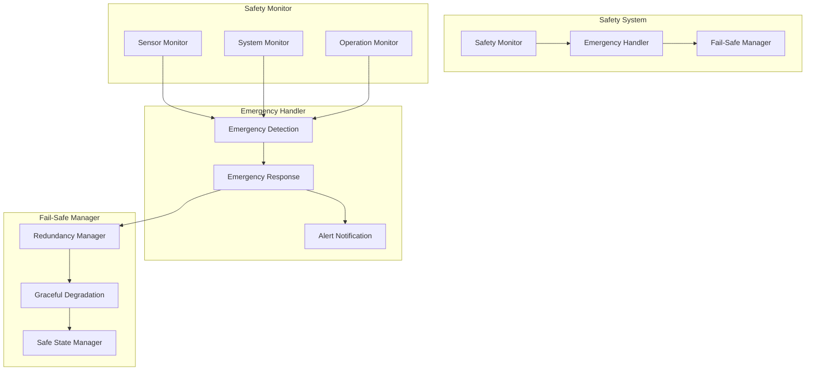

### 3.3 Software Execution Model

The Sevak mini tractor software system follows a hybrid execution model combining:

1. **Real-time Control Loops**: For motion control, sensor processing, and safety monitoring
2. **Event-driven Processing**: For handling commands, alerts, and state transitions
3. **Periodic Tasks**: For system monitoring, data logging, and maintenance functions

#### 3.3.1 Task Priorities and Execution Frequencies

| Component | Priority | Frequency | Description |
|-----------|----------|-----------|-------------|
| Safety Monitor | Critical | 100 Hz | Monitors system safety parameters |
| Motion Control | High | 50 Hz | Controls tractor movement |
| Sensor Processing | High | 20-50 Hz | Processes sensor data |
| Obstacle Detection | High | 20 Hz | Detects and tracks obstacles |
| Implement Control | Medium | 10-20 Hz | Controls fodder operations |
| Navigation | Medium | 10 Hz | Handles path planning and following |
| Communication | Medium | 5-10 Hz | Manages external communications |
| Data Logging | Low | 1 Hz | Records operational data |
| Diagnostics | Low | 0.2 Hz | Performs system diagnostics |

### 3.4 Data Management

```mermaid
graph TD
    subgraph "Data Storage"
        OperationalDB[Operational Database]
        ConfigDB[Configuration Database]
        LogDB[Log Database]
        MapDB[Map Database]
    end
    
    subgraph "Data Processing"
        DataCollector[Data Collector]
        DataProcessor[Data Processor]
        DataAnalyzer[Data Analyzer]
    end
    
    subgraph "Data Access"
        LocalAccess[Local Access]
        RemoteAccess[Remote Access]
        SyncManager[Synchronization Manager]
    end
    
    DataCollector --> OperationalDB
    DataCollector --> LogDB
    
    DataProcessor --> OperationalDB
    DataProcessor --> ConfigDB
    DataProcessor --> MapDB
## 4. Mobile App Architecture

### 4.1 App Architecture Layers

```mermaid
graph TD
    subgraph "Presentation Layer"
        UIComponents[UI Components]
        Screens[Screens]
        ViewModels[ViewModels]
    end
    
    subgraph "Business Logic Layer"
        OperationControllers[Operation Controllers]
        DataProcessors[Data Processors]
        AnalyticsEngine[Analytics Engine]
    end
    
    subgraph "Data Layer"
        LocalStorage[Local Storage]
        SyncManager[Synchronization Manager]
        APIClient[API Client]
    end
    
    subgraph "Communication Layer"
        ConnectionManager[Connection Manager]
        MessageHandler[Message Handler]
        SecurityManager[Security Manager]
    end
    
    UIComponents --> ViewModels
    Screens --> ViewModels
    
    ViewModels --> OperationControllers
    ViewModels --> DataProcessors
    ViewModels --> AnalyticsEngine
    
    OperationControllers --> APIClient
    DataProcessors --> LocalStorage
    DataProcessors --> SyncManager
    AnalyticsEngine --> LocalStorage
    
    APIClient --> ConnectionManager
    SyncManager --> ConnectionManager
    
    ConnectionManager --> MessageHandler
    MessageHandler --> SecurityManager
```

### 4.2 Mobile App Components

#### 4.2.1 User Interface Components

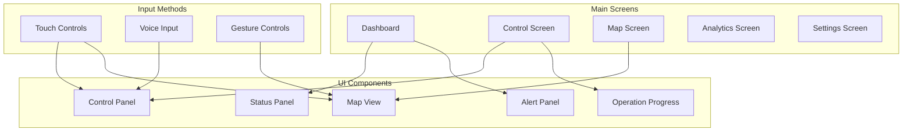

#### 4.2.2 Communication Components

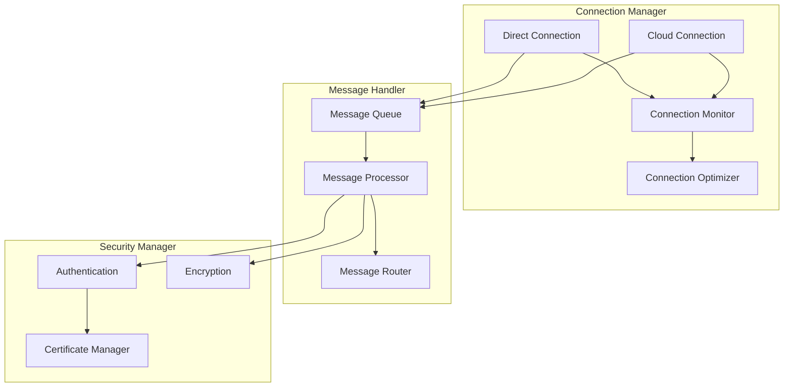

### 4.3 Mobile App Data Flow

```mermaid
graph TD
## 5. Communication Protocols

### 5.1 Communication Channels

```mermaid
graph TD
    subgraph "Tractor"
        TractorComm[Communication System]
    end
    
    subgraph "Mobile App"
        AppComm[Communication Layer]
    end
    
    subgraph "Cloud Services"
        CloudComm[Communication Services]
    end
    
    subgraph "Other Tractors"
        OtherTractorComm[Communication System]
    end
    
    TractorComm <-->|Direct Wi-Fi| AppComm
    TractorComm <-->|Bluetooth| AppComm
    TractorComm <-->|Cellular| CloudComm
    TractorComm <-->|LoRaWAN| CloudComm
    AppComm <-->|Internet| CloudComm
    TractorComm <-->|Mesh Network| OtherTractorComm
```

### 5.2 Protocol Stack

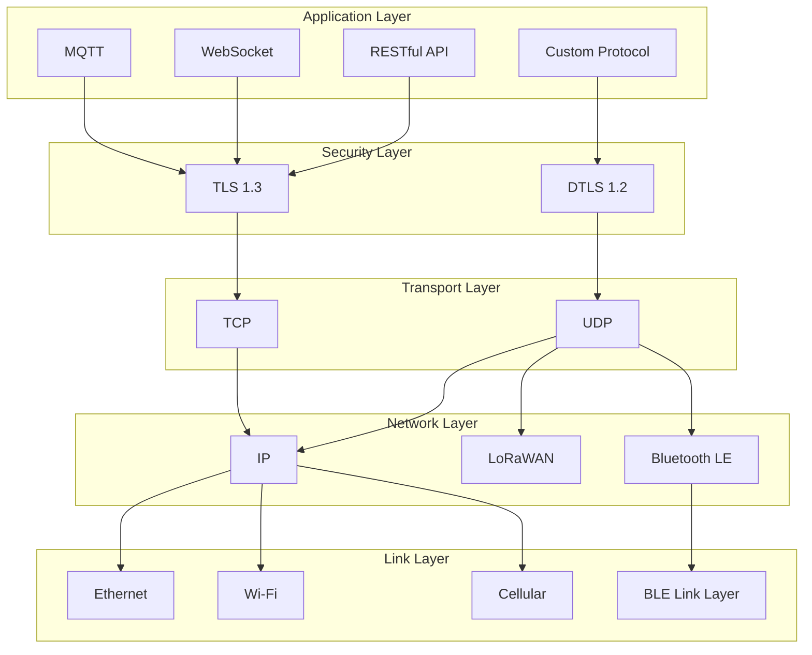

### 5.3 Message Types and Formats

#### 5.3.1 Command Messages

| Message Type | Direction | Format | Purpose |
|-------------|-----------|--------|---------|
| OperationCommand | App → Tractor | JSON | Start/stop/pause operations |
| MovementCommand | App → Tractor | Binary | Direct motion control |
| ImplementCommand | App → Tractor | JSON | Control implements |
| ConfigurationCommand | App → Tractor | JSON | Update configuration |
| DiagnosticCommand | App → Tractor | JSON | Request diagnostics |

#### 5.3.2 Status Messages

| Message Type | Direction | Format | Purpose |
|-------------|-----------|--------|---------|
| SystemStatus | Tractor → App | JSON | Overall system status |
| OperationStatus | Tractor → App | JSON | Current operation status |
| PositionStatus | Tractor → App | Binary | Current position and orientation |
| ImplementStatus | Tractor → App | JSON | Implement status |
| AlertMessage | Tractor → App | JSON | Alerts and warnings |

#### 5.3.3 Data Messages

| Message Type | Direction | Format | Purpose |
|-------------|-----------|--------|---------|
| SensorData | Tractor → App | Binary | Raw or processed sensor data |
| LogData | Tractor → App | JSON | Operation logs |
| MapData | Bidirectional | Binary | Field maps and routes |
| AnalyticsData | Tractor → App | JSON | Performance analytics |
| ConfigurationData | Bidirectional | JSON | System configuration |

### 5.4 Communication Quality of Service

| QoS Level | Use Cases | Retry Mechanism | Delivery Guarantee |
|-----------|-----------|----------------|-------------------|
| Critical | Emergency commands, safety alerts | Immediate retry with escalation | Guaranteed with acknowledgment |
| Standard | Operation commands, status updates | Retry with backoff | At-least-once delivery |
## 6. Data Flow Diagrams

### 6.1 Autonomous Navigation Data Flow

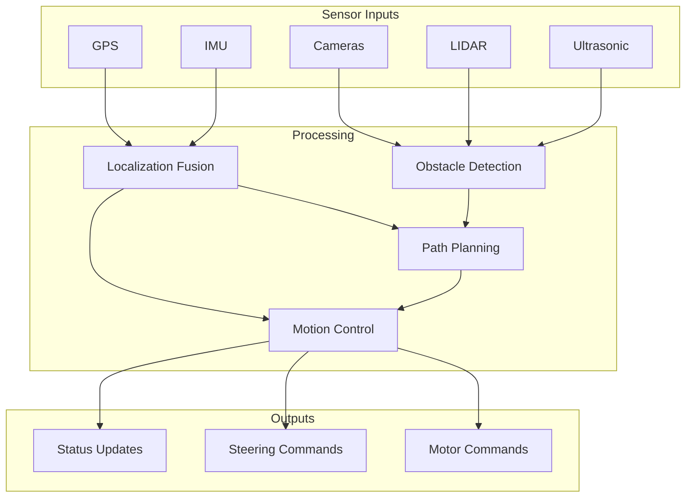

### 6.2 Fodder Operations Data Flow

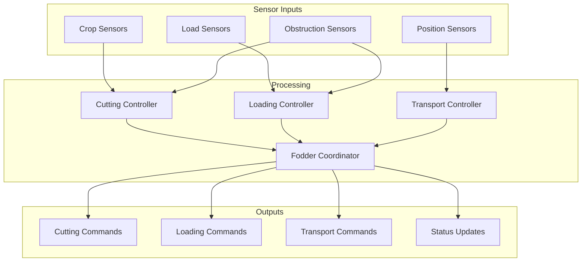

### 6.3 Mobile App to Tractor Data Flow

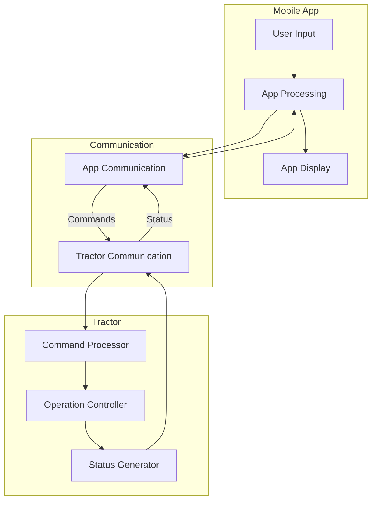

### 6.4 Multi-Tractor Coordination Data Flow

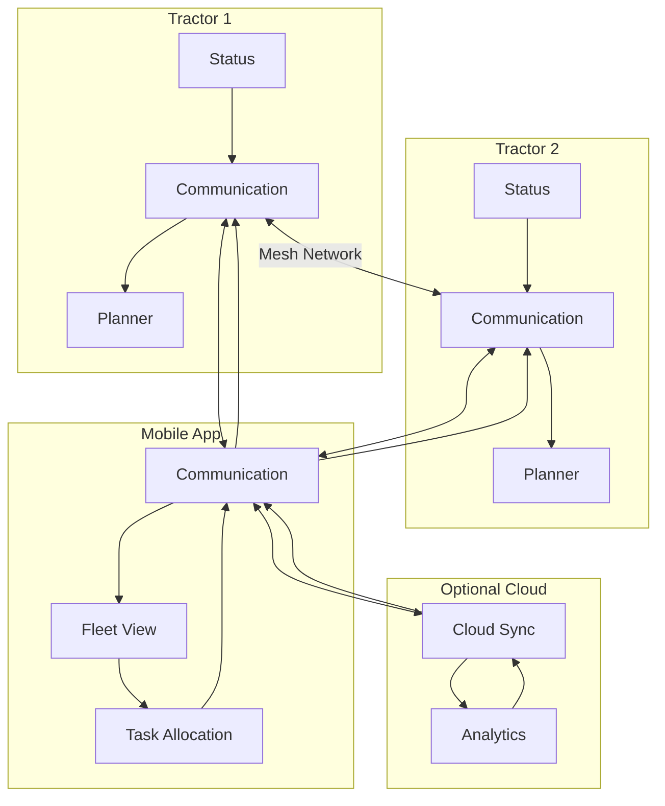

## 7. Security Architecture

### 7.1 Security Layers

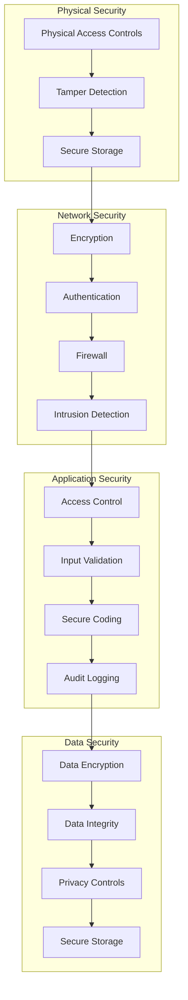

### 7.2 Authentication and Authorization

| Component | Authentication Method | Authorization Level |
|-----------|----------------------|-------------------|
| Mobile App User | Multi-factor (PIN/password + biometric) | Based on user role (owner, operator, viewer) |
| Tractor-to-App | TLS mutual authentication with certificate pinning | Based on connection type and user role |
| Tractor-to-Cloud | TLS with client certificates | Based on registered tractor ID and subscription |
| Tractor-to-Tractor | Pre-shared keys with challenge-response | Based on fleet membership |
| Remote Support | Time-limited access tokens | Limited to diagnostic functions |

### 7.3 Secure Communication

| Channel | Encryption | Key Management | Additional Protection |
|---------|------------|---------------|----------------------|
| Wi-Fi Direct | WPA3 + TLS 1.3 | Secure pairing with QR code | Message authentication codes |
| Bluetooth | BLE Secure Connections | Out-of-band pairing | Connection whitelisting |
| Cellular | TLS 1.3 | Certificate-based | IP whitelisting |
| LoRaWAN | AES-128 | Pre-provisioned keys | Message counters |
| Mesh Network | AES-256 | Rotating group keys | Packet authentication |

### 7.4 Security Monitoring and Response

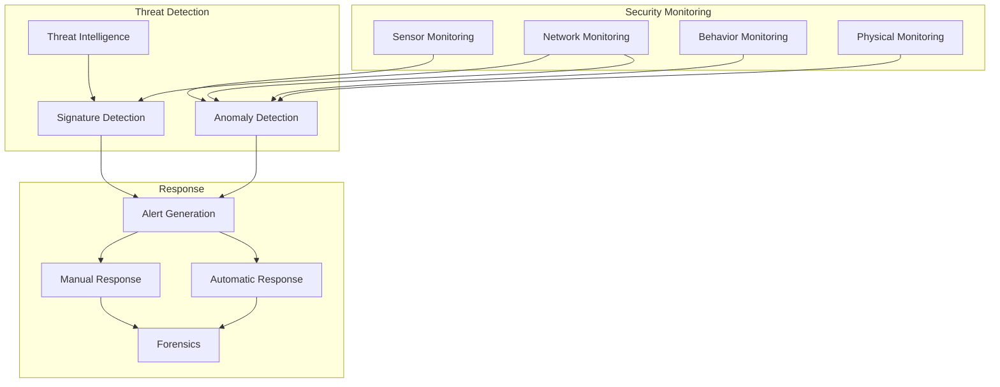

### 7.5 Security Considerations for Rural Deployment

1. **Offline Security**: Security mechanisms that function without internet connectivity
2. **Physical Security**: Tamper-evident seals and intrusion detection for unattended operation
3. **Simplified Authentication**: Accessible security for users with limited technical expertise
4. **Resilient Design**: Security that works despite power fluctuations and environmental challenges
5. **Local Control**: Ability to override security features in emergency situations
6. **Secure Updates**: Mechanisms for secure software updates with limited connectivity
7. **Cultural Adaptation**: Security measures adapted to local practices and shared usage models
| Bulk | Logs, analytics, map data | Background retry | Eventually delivered |
    subgraph "User Interaction"
        UserInput[User Input]
        UIDisplay[UI Display]
    end
    
    subgraph "App Processing"
        InputValidation[Input Validation]
        CommandGeneration[Command Generation]
        StatusProcessing[Status Processing]
        DataVisualization[Data Visualization]
    end
    
    subgraph "Data Management"
        LocalCache[Local Cache]
        PendingCommands[Pending Commands]
        ReceivedData[Received Data]
    end
    
    subgraph "Communication"
        Outbound[Outbound Messages]
        Inbound[Inbound Messages]
    end
    
    UserInput --> InputValidation
    InputValidation --> CommandGeneration
    CommandGeneration --> PendingCommands
    PendingCommands --> Outbound
    
    Inbound --> ReceivedData
    ReceivedData --> StatusProcessing
    ReceivedData --> LocalCache
    
    StatusProcessing --> DataVisualization
    DataVisualization --> UIDisplay
    
    LocalCache --> DataVisualization
```
    
    DataAnalyzer --> OperationalDB
    DataAnalyzer --> LogDB
    
    LocalAccess --> OperationalDB
    LocalAccess --> ConfigDB
    LocalAccess --> LogDB
    LocalAccess --> MapDB
    
    RemoteAccess --> SyncManager
    SyncManager --> OperationalDB
    SyncManager --> ConfigDB
    SyncManager --> LogDB
    SyncManager --> MapDB
```
        TerrainAnalyzer[Terrain Analyzer]
    end
    
    StrategicPlanner --> TacticalPlanner
    TacticalPlanner --> OperationalController
    
    RouteManager --> TaskScheduler
    TaskScheduler --> PathPlanner
    
    PathPlanner --> ObstacleManager
    ObstacleManager --> MotionController
    
    MotionController --> LocalizationManager
    
    LocalizationManager --> LocalizationService
    PathPlanner --> MapService
    MotionController --> TerrainAnalyzer
```
    EmergencyCircuits --> CuttingControl
    EmergencyCircuits --> LoadingControl
    
    MotorControllers --> EncoderInterfaces
    MotorControllers --> CurrentSensing
```
    MainController --> IO
    SafetyController --> ESCs
    SafetyController --> Brakes
    
    IO --> Implements
    IO --> HMI
```